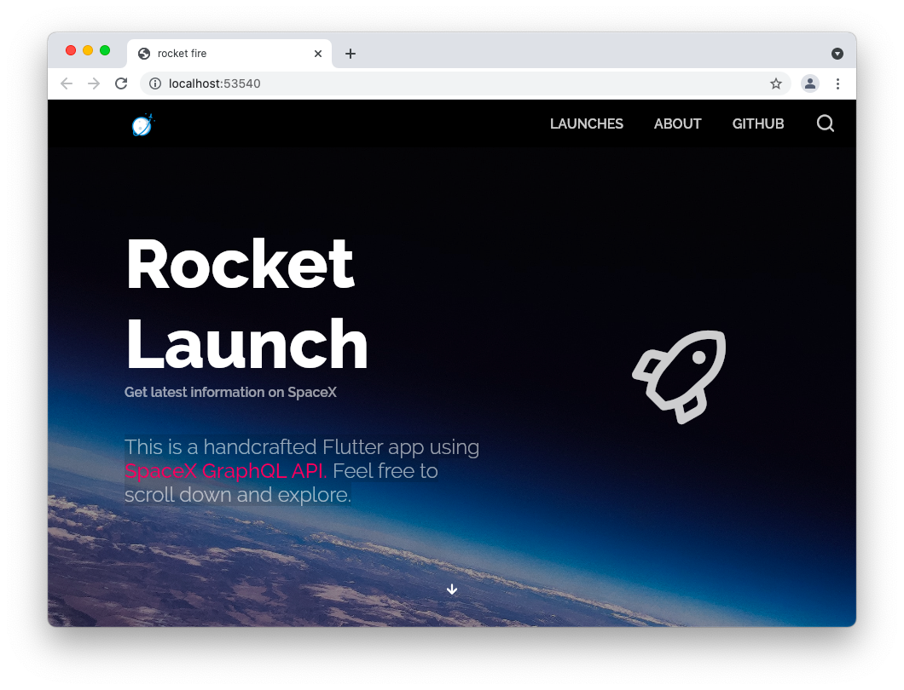
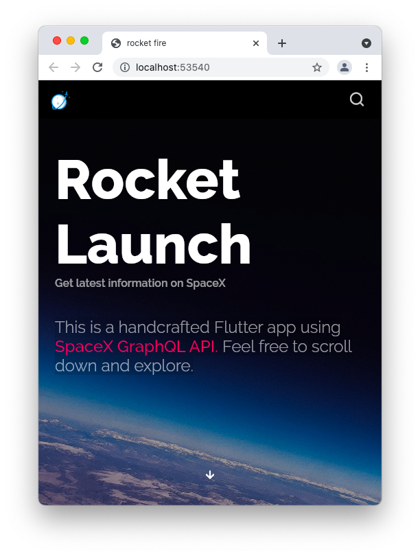
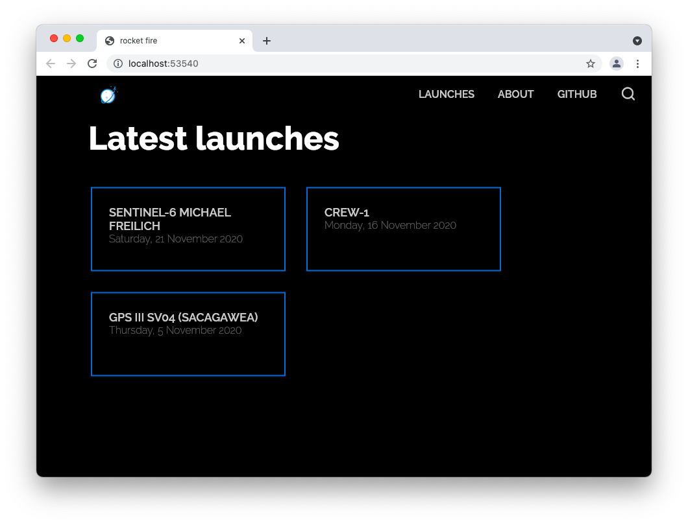
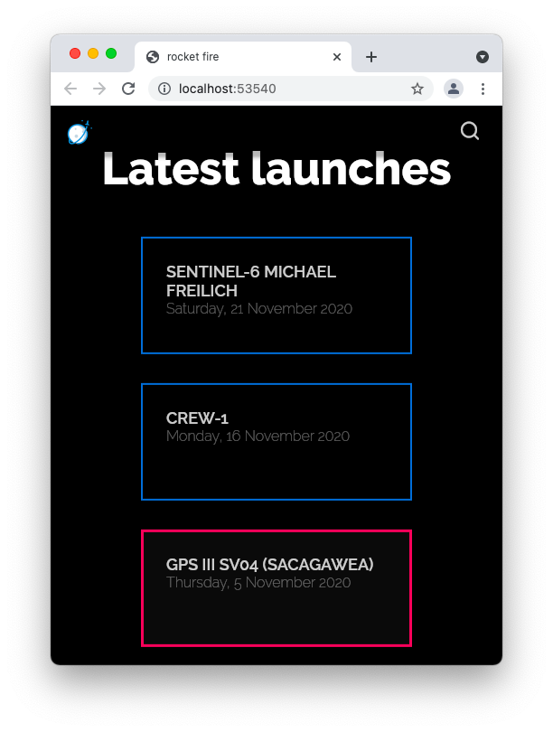

# rocketfire

A demo app using unofficial [SpaceX GraphQL API](https://github.com/SpaceXLand/api).

| desktop | mobile |
|---------|--------|
|  |  |
|  | 

## Build

Prerequisites: 
* [Flutter](https://flutter.dev)

1. Clone this repo `gh repo clone rootasjey/rocket-fire`
2. `cd rocket-fire`
3. `futter run --debug -d chrome`

## Flutter help

This project is a starting point for a Flutter application.

A few resources to get you started if this is your first Flutter project:

- [Lab: Write your first Flutter app](https://flutter.dev/docs/get-started/codelab)
- [Cookbook: Useful Flutter samples](https://flutter.dev/docs/cookbook)

For help getting started with Flutter, view our
[online documentation](https://flutter.dev/docs), which offers tutorials,
samples, guidance on mobile development, and a full API reference.
